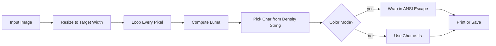

# ascii-art

[](./LICENSE)

A Python script that converts any image into colored ASCII art and prints it in the terminal using ANSI truecolor escape codes.

### How It Works



### What It Does
* Converts any image to ASCII art using a 16-level brightness density string
* Colors each character with ANSI truecolor so it actually matches the original image
* Corrects for terminal character aspect ratio so output is not stretched
* Strips ANSI codes automatically when saving to a text file
* Supports a CLI with `--width`, `--grayscale`, and `--out` flags

### Performance
Measured on Python 3.13 with a 1920x1080 JPEG (5-run average, color mode):

| Output Width | Output Grid | Avg Time |
| :--- | :--- | :--- |
| **80 chars** | 80x20 | ~19 ms |
| **120 chars** | 120x30 | ~18 ms |
| **200 chars** | 200x50 | ~26 ms |

### Quick Start
Install the only dependency:
```bash
pip install pillow
```

Run it on any image:
```bash
python ascii_art.py photo.jpg
```

Save output to a file instead:
```bash
python ascii_art.py photo.jpg --out art.txt
```

Grayscale mode for light terminal backgrounds:
```bash
python ascii_art.py photo.jpg --grayscale --width 80
```

### My Thoughts
I built this because every ASCII art tool I found either produced ugly stretched output or required 5 dependencies. The two things that actually matter here are the luma formula and the aspect ratio correction. Most tutorials use `(r+g+b)/3` which overweights red and underweights green, and the output looks washed out. Switching to ITU-R BT.601 weights fixes that. The 0.45 height squish is something you just have to tune by eye since every terminal font has a slightly different aspect ratio.
